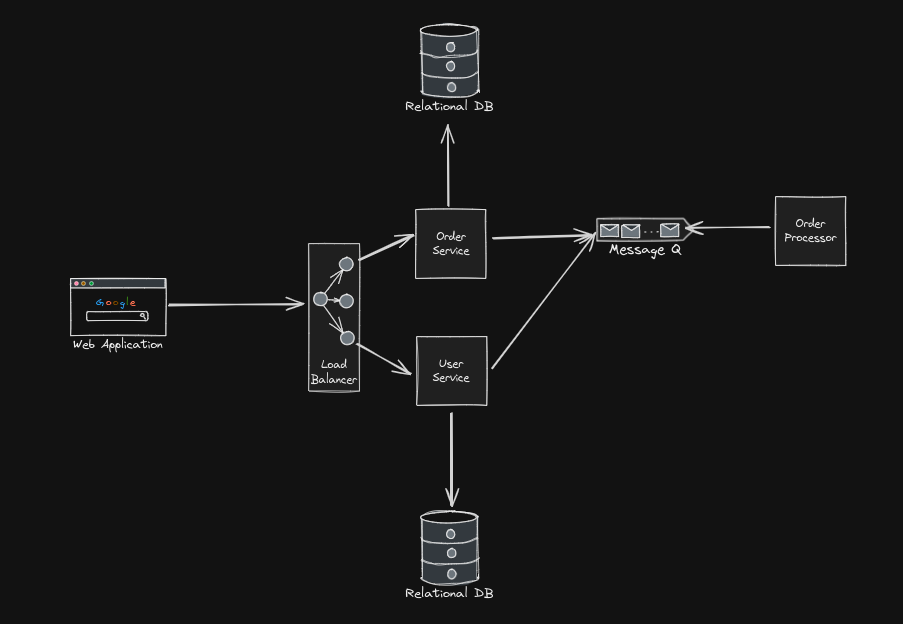
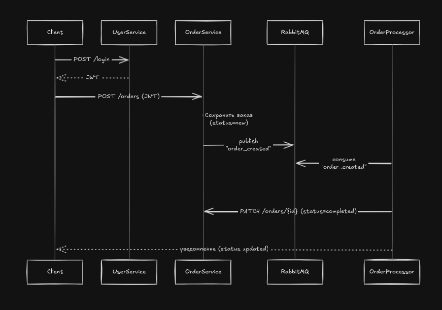

# Order Service Microservices Architecture

## Описание

Этот проект реализует микросервисную архитектуру для обработки заказов. Система состоит из нескольких сервисов, взаимодействующих между собой через REST API и очередь сообщений (RabbitMQ). Основные компоненты: UserService, OrderService, OrderProcessor, RabbitMQ и клиентское приложение.

---

## Архитектура системы



- **Web Application** — клиентское приложение, через которое пользователи взаимодействуют с системой.
- **Load Balancer** — распределяет входящие запросы между сервисами.
- **User Service** — отвечает за аутентификацию и управление пользователями.
- **Order Service** — принимает и сохраняет заказы, публикует события о создании заказа.
- **Message Q (RabbitMQ)** — очередь сообщений для асинхронной обработки заказов.
- **Order Processor** — потребляет сообщения из очереди и обрабатывает заказы.
- **Relational DB** — базы данных для хранения информации о пользователях и заказах.

---

## Сценарий работы



1. **Аутентификация пользователя**
   - Клиент отправляет POST-запрос на `/login` в UserService.
   - UserService возвращает JWT-токен.

2. **Создание заказа**
   - Клиент отправляет POST-запрос на `/orders` в OrderService, передавая JWT.
   - OrderService сохраняет заказ со статусом `new` и публикует событие `order_created` в RabbitMQ.

3. **Обработка заказа**
   - OrderProcessor подписан на событие `order_created` и начинает обработку заказа.
   - После завершения обработки OrderProcessor отправляет PATCH-запрос на `/orders/{id}` в OrderService для обновления статуса заказа на `completed`.

4. **Уведомление клиента**
   - OrderService уведомляет клиента об изменении статуса заказа.

---

## Технологии

- **Python / FastAPI** — реализация микросервисов
- **RabbitMQ** — очередь сообщений
- **JWT** — аутентификация пользователей
- **PostgreSQL/MySQL** — реляционные базы данных

---

## Запуск проекта

### Локальный запуск

1. Установите зависимости:
   ```bash
   pip install -r requirements.txt
   ```
2. Запустите сервисы вручную (например, через uvicorn):
   ```bash
   uvicorn main:app --reload
   ```
3. Убедитесь, что RabbitMQ и база данных доступны.

### Запуск через Docker

1. Убедитесь, что установлен Docker и Docker Compose.
2. Соберите и запустите все сервисы:
   ```bash
   docker-compose up --build
   ```
3. Все сервисы будут доступны в контейнерах, согласно настройкам `docker-compose.yml`.

---

## Лицензия

MIT

---

_Изображения архитектуры и сценария работы находятся в папке проекта. Используйте их для лучшего понимания взаимодействия сервисов._
